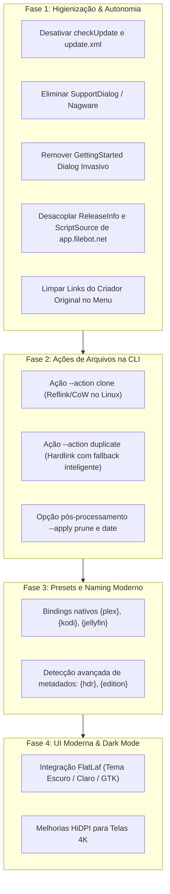

# Plano de Implementação: Higienização Completa e Modernização de Features do FileBot

Este plano estabelece a estratégia técnica para:
1. **Higienização Total**: Eliminação de todas as chamadas de verificação de atualização, alertas de upgrade para o site comercial do criador original (`rednoah` / `filebot.net`), nagware de doação/review forçado e dependências de servidores proprietários.
2. **Implementação das Features de Modernização**: Execução progressiva das melhorias levantadas no início do projeto e catalogadas em [`docs/FUTURE_FEATURES.md`](file:///home/wbaamaral/acervo/projetos/filebot/docs/FUTURE_FEATURES.md).

---

## 1. Visão Geral da Arquitetura e Fases



---

## 2. Itens para Revisão do Usuário

> [!IMPORTANT]
> **Higienização de Servidores de Dados e Scripts**:
> O FileBot original depende de `app.filebot.net` para baixar índices (`moviedb.txt.xz`, `thetvdb.txt.xz`, `anidb.txt.xz`) e o pacote de scripts padrão `m1.jar.xz`.  
> O repositório já contém cópias locais desses arquivos em `downloads/data/` e `downloads/scripts/`. Propomos embutir/empacotar esses arquivos na própria distribuição portátil e no JAR, tornando a aplicação **100% autossuficiente e offline**, sem disparar nenhuma requisição para servidores de `filebot.net`.

> [!NOTE]
> **Menu de Ajuda na UI**:
> Os links no menu de topo (`Getting Started`, `Twitter`, `Facebook`, `Forums`, `Donate`) direcionam para os canais comerciais de `rednoah`. Propomos substituí-los por um diálogo nativo de **"Sobre o FileBot (Open Source)"** e links para a documentação local em Markdown (`docs/`).

---

## 3. Mudanças Propostas por Componente

---

### Componente 1: Higienização de Alertas, Nagware e Servidores Originais

#### `[MODIFY]` [`source/net/filebot/Main.java`](file:///home/wbaamaral/acervo/projetos/filebot/source/net/filebot/Main.java)
* **Objetivo**: Desativar a chamada periódica de verificação de atualização e remoção de chamadas de nagware no ciclo de vida da interface gráfica.
* **Ações**:
  * Remover a chamada `checkUpdate()` na inicialização assíncrona (linha 184).
  * Remover a chamada `SupportDialog.maybeShow()` (linha 214) que incomodava usuários que não compraram o app na Store.
  * Remover a chamada `checkGettingStarted()` (linha 175) que abre o navegador para URLs de tutorial do criador original.
  * Remover métodos auxiliares `checkUpdate()` e `checkGettingStarted()`.

```java
// Trecho a ser removido de Main.java:
- checkGettingStarted();
- checkUpdate();
- SupportDialog.maybeShow();
```

#### `[MODIFY]` [`source/net/filebot/ui/SupportDialog.java`](file:///home/wbaamaral/acervo/projetos/filebot/source/net/filebot/ui/SupportDialog.java)
* **Objetivo**: Neutralizar completamente qualquer exibição do diálogo de doação/review.
* **Ações**:
  * Tornar `maybeShow()` um método vazio (no-op), garantindo que nada seja disparado mesmo se for chamado por scripts legados.

```java
public static void maybeShow() {
    // Desativado: software comunitário livre de nagware e popups de doação
}
```

#### `[MODIFY]` [`source/net/filebot/ui/FileBotMenuBar.java`](file:///home/wbaamaral/acervo/projetos/filebot/source/net/filebot/ui/FileBotMenuBar.java)
* **Objetivo**: Eliminar links promocionais e redes sociais do autor original (`filebot.net`, Twitter, Facebook).
* **Ações**:
  * Substituir itens por "Sobre o FileBot", "Atalhos de Teclado" e "Documentação".

#### `[MODIFY]` [`app.properties`](file:///home/wbaamaral/acervo/projetos/filebot/app.properties) e [`source/net/filebot/Settings.properties`](file:///home/wbaamaral/acervo/projetos/filebot/source/net/filebot/Settings.properties)
* **Objetivo**: Limpar propriedades que apontam para servidores de `filebot.net`.
* **Ações**:
  * Limpar `update.url` e `donate.url`.
  * Redirecionar `url.data` e `github.stable` para leitura local de `downloads/data/` e `downloads/scripts/m1.jar.xz`.

#### `[MODIFY]` [`source/net/filebot/media/ReleaseInfo.java`](file:///home/wbaamaral/acervo/projetos/filebot/source/net/filebot/media/ReleaseInfo.java)
* **Objetivo**: Carregar bases de dados exclusivamente de arquivos locais ou recursos empacotados, sem fazer requisições a `app.filebot.net`.

---

### Componente 2: Ações de Linha de Comando e Sistema de Arquivos Moderno

#### `[MODIFY]` [`source/net/filebot/StandardRenameAction.java`](file:///home/wbaamaral/acervo/projetos/filebot/source/net/filebot/StandardRenameAction.java)
* **Objetivo**: Adicionar suporte às ações modernas:
  * `CLONE`: Copy-on-Write (reflink) via chamada nativa Linux `ioctl(dest_fd, FICLONE, src_fd)`. Suportado em Btrfs e XFS. Cria cópias instantâneas sem ocupar espaço físico em disco.
  * `DUPLICATE`: Tenta criar *hardlink*; se os arquivos estiverem em sistemas de arquivos diferentes ou não suportado, realiza cópia normal automaticamente.
  * `TEST`: Executa a pipeline completa de validação sem gravar no disco.

#### `[MODIFY]` [`source/net/filebot/cli/ArgumentBean.java`](file:///home/wbaamaral/acervo/projetos/filebot/source/net/filebot/cli/ArgumentBean.java) e [`source/net/filebot/cli/CmdlineOperations.java`](file:///home/wbaamaral/acervo/projetos/filebot/source/net/filebot/cli/CmdlineOperations.java)
* **Objetivo**: Adicionar o parâmetro `--apply`:
  * `--apply prune`: Limpeza de diretórios vazios e sobras (`.nfo`, `.url`, trailers/samples) após renomeação.
  * `--apply date`: Sincroniza a data de modificação (`lastModifiedTime`) com o ano/data de exibição do filme/série.

---

### Componente 3: Naming Presets Modernos (`{plex}`, `{kodi}`, `{hdr}`, `{edition}`)

#### `[MODIFY]` [`source/net/filebot/format/MediaBindingBean.java`](file:///home/wbaamaral/acervo/projetos/filebot/source/net/filebot/format/MediaBindingBean.java)
* **Objetivo**: Implementar variáveis de formatação modernas solicitadas em `docs/FUTURE_FEATURES.md`:
  * `{plex}`: Retorna a estrutura padronizada oficial do Plex (`Movies/Title (Year)/Title (Year) [Quality].ext` ou `TV Shows/Title/Season XX/Title - SXXEXX - Episode.ext`).
  * `{kodi}` / `{jellyfin}`: Padrões específicos para Kodi e Jellyfin.
  * `{hdr}`: Detecta faixas e perfis HDR (HDR10, HDR10+, Dolby Vision, HLG) a partir dos fluxos de vídeo.
  * `{edition}`: Detecta cortes especiais (Director's Cut, Extended, Remastered, IMAX).

---

### Componente 4: Interface Moderna com Suporte a Modo Escuro (FlatLaf)

#### `[MODIFY]` [`ivy.xml`](file:///home/wbaamaral/acervo/projetos/filebot/ivy.xml) e [`build.xml`](file:///home/wbaamaral/acervo/projetos/filebot/build.xml)
* **Objetivo**: Adicionar a biblioteca open-source moderna **FlatLaf** (`com.formdev:flatlaf:3.5.4`).

#### `[MODIFY]` [`source/net/filebot/util/ui/SwingUI.java`](file:///home/wbaamaral/acervo/projetos/filebot/source/net/filebot/util/ui/SwingUI.java)
* **Objetivo**: Inicializar o Look & Feel FlatLaf Dark/Light com detecção automática do tema do sistema operacional (KDE Plasma GTK/Dark).

---

## 4. Plano de Verificação

### Testes Automatizados
```bash
# 1. Compilação do fatjar e checagem de integridade das classes
ant fatjar

# 2. Execução da suíte de testes unitários existentes
ant test

# 3. Teste de linha de comando sem conexão de rede (verificação offline)
unshare -n ./filebot -version
```

### Verificação Manual
1. **Verificação de Higienização**:
   * Iniciar a aplicação gráfica (`./filebot` ou `/usr/local/bin/filebot`).
   * Confirmar que nenhuma janela modal de "Doação", "Getting Started" ou "Nova Versão Disponível" é exibida.
   * Abrir o menu de Ajuda e verificar que não há links comerciais para redes sociais de terceiros.
2. **Verificação de CLI**:
   * Testar a nova ação `--action test` em arquivos de amostra:
     `filebot -rename /caminho/teste --action test -non-strict`
   * Testar o binding `{plex}` em expressões de renomeação.
